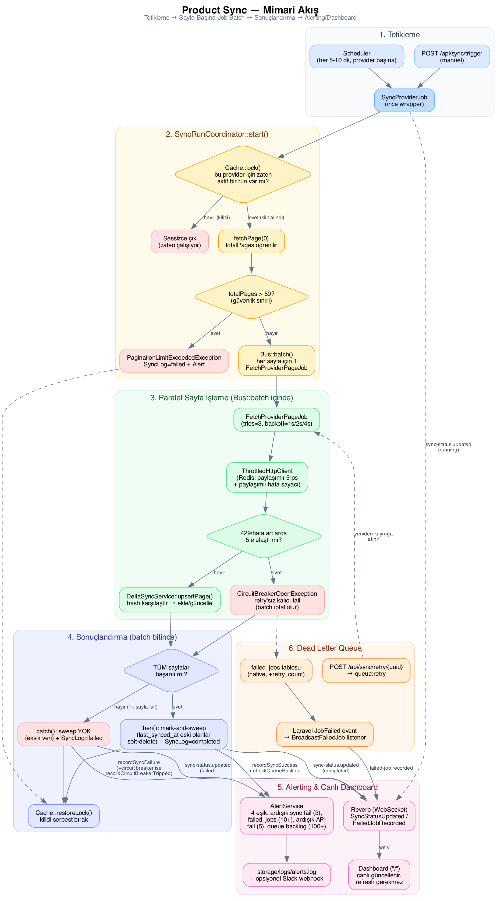
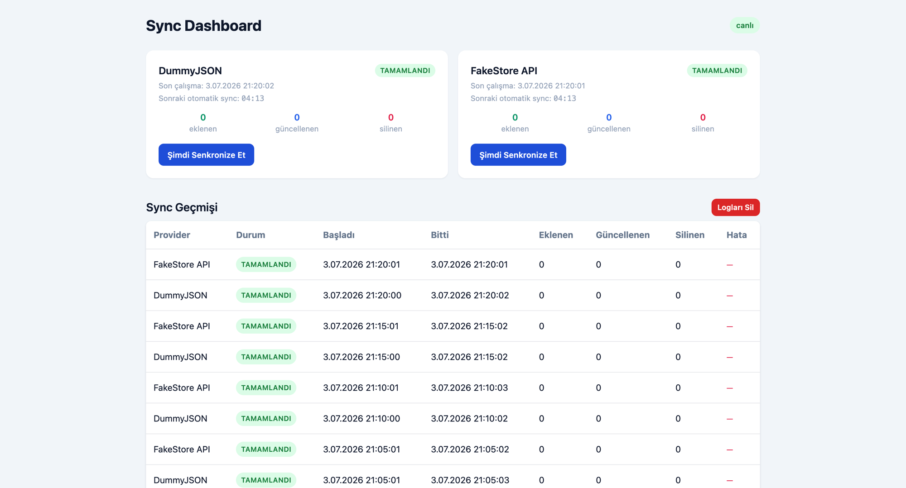

# Product Sync — Provider-Agnostic Delta Sync Sistemi

İki farklı tedarikçi API'sinden (DummyJSON, FakeStore) ürün verisini,
kuyruklu ve hash-bazlı delta sync ile local bir MySQL veritabanına
senkronize eden Laravel uygulaması. Bu depo bir teknik case (butterfly-team
/2025-product-sync-case) için hazırlanmıştır — orijinal gereksinimler
[`gereksinimler.md`](gereksinimler.md) dosyasında korunmuştur.

Bu README; kurulumu, mimariyi, sistemin uçtan uca nasıl çalıştığını, alınan
teknik kararları ve hata senaryolarında ne olduğunu anlatır.

## İçindekiler

1. [Teknolojiler](#1-teknolojiler)
2. [5 Dakikada Kurulum](#2-5-dakikada-kurulum)
3. [Mimari](#3-mimari)
4. [Sistem Uçtan Uca Nasıl Çalışır](#4-sistem-uçtan-uca-nasıl-çalışır)
5. [Teknik Kararlar ve Gerekçeleri](#5-teknik-kararlar-ve-gerekçeleri)
6. [Fail Durumlarında Ne Olur?](#6-fail-durumlarında-ne-olur)
7. [API Dokümantasyonu](#7-api-dokümantasyonu)
8. [Gerçek Zamanlı Dashboard](#8-gerçek-zamanlı-dashboard)
9. [Veritabanı Şeması](#9-veritabanı-şeması)
10. [Testler](#10-testler)
11. [Bonus Özellikler](#11-bonus-özellikler)
12. [Proje Yapısı](#12-proje-yapısı)
13. [Bilinen Sınırlamalar](#13-bilinen-sınırlamalar)

---

## 1. Teknolojiler

| Katman | Teknoloji | Not |
|---|---|---|
| Dil / Framework | PHP 8.2, Laravel 10.x | Framework tercihi case'de serbest bırakılmıştı, Laravel seçildi (queue/Horizon/Reverb/test altyapısı hazır) |
| Veritabanı | MySQL 8 | Hem uygulama (`db`) hem testler (`db_test`, ayrı container) için — testler de gerçek MySQL'e karşı koşuyor |
| Cache / Queue / Lock | Redis 7 + Predis | `predis` bilinçli tercih — pure-PHP client, `phpredis` C-extension derlemesi gerektirmiyor, Docker image'ı yalın kalıyor |
| Queue dashboard | Laravel Horizon | Kuyruk izleme, retry, metrikler |
| Gerçek zamanlı | Laravel Reverb (WebSocket) | Dashboard'un sıfır-polling canlı güncellemeleri için |
| Frontend | Blade + Vanilla JS + Tailwind (CDN) | Build adımı yok; `package.json`/`vite.config.js` iskeletten kalma, kullanılmıyor |
| Container | Docker Compose | 7 servis: `webserver`, `server`, `worker`, `reverb`, `db`, `db_test`, `redis` |
| Test | PHPUnit 10 | MySQL (`db_test`) container'ına karşı, Xdebug ile coverage ölçümü |

---

## 2. 5 Dakikada Kurulum

```bash
git clone <bu-repo>
cd 2025-product-sync-case
cp .env.example .env
cp .env.testing.example .env.testing

docker compose up -d --build

docker exec server php artisan key:generate
docker exec server php artisan migrate

# Tarayıcıda aç:
open http://localhost:8080
```

`.env.testing`, testlerin (`docker exec server php artisan test`) kullandığı
ayrı ortam dosyasıdır (bkz. §10 Testler) — `.env`'den bağımsızdır, `db_test`/
`sync` queue/`array` cache gibi test-özel değerleri içerir.

Bu kadar. `docker compose up` ile 7 container ayağa kalkar:

| Container | Görev |
|---|---|
| `webserver` | nginx — PHP-FPM'e ve Reverb'e proxy |
| `server` | PHP-FPM (uygulama, API) |
| `worker` | Horizon (kuyruk) + scheduler (`schedule:work`), supervisord altında |
| `reverb` | WebSocket sunucusu (dashboard'un canlı güncellemeleri) |
| `db` | MySQL 8 — uygulama verisi |
| `db_test` | MySQL 8 — **sadece testler**, `db`'den tamamen izole (ayrı port: 3307) |
| `redis` | Cache + Queue + dağıtık kilit |

Manuel bir sync tetiklemek için:

```bash
curl -X POST http://localhost:8080/api/sync/trigger \
  -H "Content-Type: application/json" \
  -d '{"provider":"dummyjson"}'
```

veya doğrudan dashboard'daki "Sync" butonuna basın — sonucu, sayfayı hiç
yenilemeden, WebSocket üzerinden anlık göreceksiniz.

Scheduler zaten her `SYNC_INTERVAL_MINUTES` (varsayılan 5) dakikada bir her
iki provider için otomatik sync tetikler — hiçbir şey yapmanıza gerek yok,
`worker` container'ı ayaktayken kendiliğinden çalışır.

### Horizon dashboard'u

```
http://localhost:8080/horizon
```

`product-sync` kuyruğundaki tüm job'ları, retry'ları, throughput'u buradan
izleyebilirsiniz.

---

## 3. Mimari



Yukarıdaki diyagram, bir sync run'ının tetiklenmesinden (scheduler veya
`/api/sync/trigger`) dashboard'da sonucun görünmesine kadar olan tüm akışı
6 aşamada gösterir. Kaynak Graphviz dosyası: [`docs/architecture-flow.dot`](docs/architecture-flow.dot).

### Katmanlar (Contracts → Services → DTOs → Jobs → Controllers)

```
app/Contracts/ProviderClientInterface.php     ← provider soyutlaması (fetchPage, fetchOne)
app/Services/Providers/
  ├── DummyJsonProvider.php                   ← sayfalı API implementasyonu
  ├── FakeStoreProvider.php                   ← sayfalamasız API implementasyonu (totalPages=1)
  └── ProviderFactory.php                     ← ProviderType → client çözümlemesi

app/Services/Sync/
  ├── HashService.php                         ← sha256 içerik hash'i
  ├── DeltaSyncService.php                    ← upsert (ekle/güncelle/no-op)
  ├── SyncRunCoordinator.php                  ← orkestrasyon: kilit, batch, sweep-delete, sayaç toplama
  └── ThrottledHttpClient.php                  ← rate limit + backoff + circuit breaker (Redis-paylaşımlı)

app/Jobs/
  ├── SyncProviderJob.php                     ← ince tetikleyici (coordinator'ı çağırır)
  └── FetchProviderPageJob.php                ← tek sayfayı çeker + upsert eder (batch elemanı)

app/Services/Alerts/AlertService.php          ← 4 eşik kontrolü, throttled JSON log + opsiyonel Slack

app/Http/Controllers/Api/                     ← ince controller'lar (SyncController, ProductController, HealthController)
app/Http/Traits/ApiResponseTrait.php          ← tüm response'ların ortak zarfı

app/Events/{SyncStatusUpdated,FailedJobRecorded}.php  ← Reverb'e ShouldBroadcastNow yayınları
resources/views/dashboard.blade.php + public/js/dashboard.js + public/css/dashboard.css
```

### Neden "sayfa-başına-job" mimarisi?

DummyJSON'ın `GET /products` endpoint'i sayfalıdır (`limit`/`skip`/`total`).
Bir provider'ın verisini tek bir job'un kendi içinde döngüyle çekmesi yerine,
**her sayfa kendi job'unu** alır: `SyncRunCoordinator::start()` önce sadece
ilk sayfayı çekip `totalPages`'i öğrenir, sonra `totalPages` kadar
`FetchProviderPageJob` içeren bir `Bus::batch()` dispatch eder. Bu tasarımın
kazandırdıkları:

- Hiçbir job tüm veriyi tek başına çekmeye çalışmaz → ürün sayısı arttıkça
  veya rate-limit/backoff devreye girdikçe queue worker timeout'una çarpma
  riski yok.
- Sayfalar paralel işlenebilir (Horizon `balance: auto` ile birden fazla
  worker process'i).
- Bir sayfa kalıcı olarak başarısız olursa sadece o sayfa job'u (ve
  `Bus::batch()->catch()` üzerinden tüm batch) başarısız sayılır — diğer
  sayfaların sonucu kaybolmaz, ama sweep-delete BİLEREK çalıştırılmaz
  (bkz. §6 "Bir sayfa job'u kalıcı başarısız olursa").
- `MAX_PAGES = 50` güvenlik sınırı: provider'ın `total` alanı anormal
  büyük/bozuksa binlerce job kuyruklanmaz, sync anlaşılır bir hatayla durur.

FakeStore API sayfalama yapmadığı için (`GET /products` tüm 20 ürünü tek
seferde döner) bu provider için batch her zaman tek elemanlıdır — mimari
provider'a göre şube açmaz, `totalPages=1` demesi yeterlidir.

---

## 4. Sistem Uçtan Uca Nasıl Çalışır

**1) Tetikleme.** Scheduler (`app/Console/Kernel.php`, her provider için
`*/5 * * * *`) veya `POST /api/sync/trigger`, provider-agnostic
`SyncProviderJob`'ı `product-sync` kuyruğuna dispatch eder.

**2) `SyncRunCoordinator::start()`.**
- `Cache::lock('product-sync-lock:{provider}', 900)` ile dağıtık kilit
  alınmaya çalışılır. Alınamazsa (aynı provider için zaten aktif bir run
  varsa) fonksiyon sessizce döner — **job uniqueness** burada sağlanır.
- Yeni bir `sync_logs` satırı `status=running` ile oluşturulur;
  `SyncStatusUpdated` event'i hemen yayınlanır (dashboard "çalışıyor"
  durumunu HTTP polling beklemeden anında gösterir).
- İlk sayfa (`page=0`) çekilir → `totalPages` öğrenilir.
- `totalPages` kadar `FetchProviderPageJob(provider, page, syncRunStartedAt, syncLogId)`
  içeren bir `Bus::batch()` dispatch edilir ve coordinator **beklemeden
  döner** (batch arka planda ilerler).

**3) Paralel sayfa işleme.** Her `FetchProviderPageJob`:
- `ThrottledHttpClient` üzerinden (Redis-paylaşımlı rate limit + circuit
  breaker ile) kendi sayfasını çeker.
- `DeltaSyncService::upsertPage()` ile her ürünü tek tek, `DB::transaction()`
  + `lockForUpdate()` altında upsert eder: hash aynıysa sadece
  `last_synced_at`/`last_synced_log_id` tazelenir (no-op), farklıysa
  güncellenir, hiç yoksa eklenir.
- Kendi added/updated sayısını `SyncRunCoordinator::recordPageResult()`
  ile paylaşımlı Redis sayaçlarına ekler.

**4) Sonuçlandırma.** Batch'teki TÜM sayfalar bitince (`Bus::batch()->then()`):
- **Sweep-delete**: bu provider'ın, bu run'ın `sync_logs.id`'sinden FARKLI
  bir `last_synced_log_id`'ye sahip (yani bu run'da hiçbir sayfa tarafından
  görülmemiş) aktif ürünleri soft-delete eder.
- Redis sayaçları toplanıp `sync_logs` satırı `completed` + added/updated/
  deleted sayılarıyla güncellenir.
- `AlertService::recordSyncSuccess()` + `checkQueueBacklog()` çağrılır.
- `SyncStatusUpdated` (completed) yayınlanır → dashboard anında güncellenir.
- Kilit serbest bırakılır.

Batch'teki herhangi bir sayfa kalıcı başarısız olursa (`->catch()`) aynı
akış `finishWithFailure()` üzerinden işler — sweep ÇALIŞTIRILMAZ (bkz. §6).

**5) Alerting & canlı dashboard.** `AlertService`, 4 eşiği (art arda sync
başarısızlığı, failed job birikimi, art arda API başarısızlığı/circuit
breaker, queue backlog) kontrol eder; eşik aşılırsa throttled (5 dk)
structured JSON log (`storage/logs/alerts.log`) + opsiyonel Slack webhook
üretir. Dashboard, tüm bu olayları Reverb üzerinden WebSocket ile anlık
alır — sayfa hiç yenilenmez.

**6) Dead Letter Queue.** 3 denemesi de tükenen bir `FetchProviderPageJob`,
Laravel'in native `failed_jobs` tablosuna düşer. Dashboard'daki "Retry"
butonu veya `POST /api/sync/retry/{uuid}` ile tekrar kuyruğa alınabilir.

---

## 5. Teknik Kararlar ve Gerekçeleri

### 5.1 Database tasarımı

- **`products`**: `unique(provider_type, external_id)` — idempotency'nin
  temeli. `data_hash` (char(64), sha256) + kendi index'i — delta
  karşılaştırması bu kolon üzerinden. `last_synced_log_id` (unsignedBigInteger,
  `provider_type` ile bileşik index) — sweep-delete kararının GERÇEK
  mekanizması (bkz. 5.6). `deleted_at` (soft delete) + kendi index'i.
  `price` → `decimal(10,2)` (float değil — parasal değer), `stock` →
  `unsignedInteger`, `description` → `text` (nullable).
- **`sync_logs`**: `(provider_type, started_at)` bileşik index — history
  sorgusu bunu kullanır. `status` enum yerine bilerek `string(32)` — case'in
  şemasında da string, gelecekte yeni bir durum eklemek migration
  gerektirmez.
- **`failed_jobs`**: Laravel'in native tablosu + tek eklenen `retry_count`
  kolonu. **Ayrı bir DLQ tablosu bilerek yaratılmadı** — Laravel'in
  `queue:retry`/`queue:failed` komutları zaten bunun üzerinde çalışıyor;
  paralel bir DLQ tablosu senkronizasyon/tutarlılık sorunu (iki kaynak of
  truth) yaratırdı.

### 5.2 Hash calculation stratejisi

`HashService::hash()` — `{name, price (2 ondalığa normalize edilmiş
string), stock, description}` alanlarının `json_encode` çıktısının
**sha256**'sı. Bilerek hariç tutulanlar:

- `external_id`/`provider_type` — bunlar kimlik bilgisi, içerik değil;
  değişmezler zaten.
- Provider'a özgü volatile alanlar (`rating`, `images`, `category`) —
  bunlar değişse bile "ürün içeriği" (case'in sync etmemizi istediği
  `name/price/stock/description`) değişmiş sayılmaz; her API çağrısında
  rating oynadığı için dahil edilselerdi her sync "her şey değişti"
  raporlardı (delta sync'in anlamını yok ederdi).

`price`, `number_format($price, 2, '.', '')` ile normalize edilir ki float
temsil hassasiyeti (`9.990000001` gibi) hash'i gereksiz yere değiştirmesin.

### 5.3 Job uniqueness

Case'in istediği "provider bazında aynı anda sadece 1 sync job" kısıtı,
`SyncProviderJob`'ın `ShouldBeUnique` interface'i ile **değil**,
`SyncRunCoordinator::start()` içinde elle tutulan bir
`Cache::lock('product-sync-lock:{provider}', 900)` ile sağlanır.

**Neden `ShouldBeUnique` yetmedi:** `ShouldBeUnique`, tek bir job'un
ömrüne bağlı bir kilit sağlar. Ama bu mimaride "bir provider'ın sync'i"
artık tek bir job değil, `SyncProviderJob` + N adet `FetchProviderPageJob`'dan
oluşan bir `Bus::batch()`'in TAMAMI. `SyncProviderJob` batch'i dispatch
edip hemen döndüğü için, `ShouldBeUnique` kilidi batch daha bitmeden
serbest kalırdı — ikinci bir sync bu sırada rahatça başlayabilirdi. Bu
yüzden kilit elle alınıp, batch'in `then()`/`catch()` callback'lerinden
(hangisi TETİKLENİRSE, farklı bir process/job içinden) `Cache::restoreLock()`
ile (owner token taşınarak) serbest bırakılıyor — 900 saniyelik TTL,
worker kilidi bırakmadan çökerse diye kendiliğinden iyileşme tavanı.

### 5.4 Idempotency

Üç katmanlı garanti:

1. **Unique constraint**: `(provider_type, external_id)` — aynı ürün iki
   kez insert edilemez (DB seviyesinde garanti).
2. **Transaction + row lock**: `DeltaSyncService::upsertPage()`'de her
   ürün `DB::transaction()` + `lockForUpdate()` altında işlenir — yarıda
   kesilse bile ya tamamen uygulanır ya hiç uygulanmaz.
3. **Hash no-op skip**: hash aynıysa `UPDATE` bile çalışmaz, sadece
   `last_synced_at`/`last_synced_log_id` tazelenir — job iki kez çalışsa
   bile `products_updated` sayısı şişmez, gereksiz write olmaz.

Aynı sync run'ı (aynı `syncLogId` ile) tekrar çalıştırılsa bile: mevcut
ürünler ya no-op ya da aynı sonuca güncellenir, yeni ürün tekrar eklenmez
— bu, `tests/Unit/Services/Sync/DeltaSyncServiceTest.php` ve
`tests/Feature/SyncIdempotencyAndSweepTest.php` ile doğrulanmıştır.

### 5.5 Rate limiting & circuit breaker

`ThrottledHttpClient` (bkz. `app/Services/Sync/ThrottledHttpClient.php`):

- **Pacing**: `Cache::lock()` korumalı bir read-modify-write ile
  Redis'te `throttle:next-allowed:{provider}` damgası tutulur; her istek
  öncesi `usleep()` ile gerekirse beklenir. `1/rate_limit_per_second`
  (varsayılan 5rps) aralık garanti edilir.
- **Backoff**: 429 veya bağlantı hatasında `1s, 2s, 4s` (case'in istediği
  aralıklar) bekleyip tekrar dener.
- **Circuit breaker**: ardışık başarısızlık sayacı da Redis'te paylaşımlı
  tutulur; `SYNC_MAX_CONSECUTIVE_FAILURES` (varsayılan 5) aşılırsa
  `CircuitBreakerOpenException` fırlatılır — sync tamamen durur, alert
  üretilir.

**Neden Redis-paylaşımlı, instance-local değil:** sayfa-başına-job
mimarisinde aynı provider'ın sayfaları FARKLI worker process'lerinde aynı
anda çalışabilir. Pacing/sayaç instance-local (PHP static/property) olsaydı,
her worker kendi başına 5rps uygular ve toplamda API'nin gerçek limitini
aşardı; aynı şekilde "ardışık 5 başarısızlık" sorusu da tüm worker'lar
birlikte cevaplanmadan yanlış olurdu.

### 5.6 Silme tespiti (mark-and-sweep) — ID bazlı, saat bazlı DEĞİL

Bir provider'ın API'sinden artık dönmeyen ürünler nasıl tespit edilir?
Hiçbir tek çağrı artık uzak listenin TAMAMINI görmüyor (sayfalar ayrı
job'larda) — bu yüzden **mark-and-sweep** kullanılır:

- Her sayfa job'u, upsert ettiği her ürüne `last_synced_log_id = <bu run'ın
  sync_logs.id'si>` yazar ("mark").
- Batch TAMAMEN bitince (`finishSuccessfully`), bu provider'ın
  `last_synced_log_id`'si bu run'ınkinden FARKLI olan tüm aktif ürünleri
  soft-delete eder ("sweep") — yani bu run'da HİÇBİR sayfa tarafından
  görülmemiş ürünler.

Karar saat (`last_synced_at`) yerine bilinçli olarak monoton bir ID
(`sync_logs.id`) üzerinden veriliyor: iki run ne kadar hızlı art arda
çalışırsa çalışsın (ör. testlerde `Http::fake()`'in sıfır ağ gecikmesiyle),
`now()` çağrıları container'ın saat çözünürlüğünde çakışabilir — saat
karşılaştırması bu yüzden güvenilir bir sweep kriteri değil. Auto-increment
ID ise iki run'ı her zaman kesin olarak ayırt eder. Aynı gerekçeyle
`SyncController::status()`/`history()` da `latest('started_at')` değil
`latest('id')` kullanır. Tam teknik döküm: [`CHANGELOG.md`](CHANGELOG.md).

Bir sayfa kalıcı başarısız olup batch iptal edilirse sweep BİLİNÇLİ
olarak çalıştırılmaz — elimizde uzak listenin sadece bir kısmı olur,
görülmemiş sayfalardaki ürünleri yanlışlıkla silmiş oluruz.

---

## 6. Fail Durumlarında Ne Olur?

| Senaryo | Sistem tepkisi |
|---|---|
| **Tek bir HTTP isteği 429/bağlantı hatası** | `ThrottledHttpClient` 1s→2s→4s backoff ile 3 kez dener. Son deneme de başarısızsa `ProviderRequestException` fırlatılır → o sayfa job'unun kendi `tries=3`/`backoff=[1,2,4]` mekanizması devreye girer. |
| **Bir sayfa job'u 3 denemesini de tüketir** | Job Laravel'in `failed_jobs` tablosuna düşer (DLQ). Batch iptal edilir (`Bus::batch()->catch()`) → `SyncRunCoordinator::finishWithFailure()`: `sync_logs` satırı `status=failed` + hata mesajıyla kapanır, **sweep-delete çalıştırılmaz** (§5.6), `AlertService::recordSyncFailure()` çağrılır, dashboard'a `SyncStatusUpdated(failed)` yayınlanır, kilit serbest bırakılır (yeni bir sync hemen denenebilir). |
| **Ardışık `SYNC_MAX_CONSECUTIVE_FAILURES` (varsayılan 5) istek başarısız** | `CircuitBreakerOpenException` fırlatılır. Sayfa job'u bunu retry ETMEDEN `$this->fail()` ile kalıcı başarısız işaretler (tekrar denemek anlamsız — provider zaten ayakta değil) → batch hemen iptal olur, bekleyen diğer sayfa job'ları da çalışmadan atlanır. `AlertService::recordCircuitBreakerTripped()` alert üretir. |
| **İlk sayfa (`page=0`) çekilirken hata** | `SyncRunCoordinator::start()`'ın kendi `try/catch`'i yakalar: `sync_logs` direkt `failed` olarak kapanır (hiç batch dispatch edilmez), kilit hemen serbest bırakılır, exception yeniden fırlatılır → `SyncProviderJob`'ın kendi `tries=3` mekanizması devreye girer; o da tükenirse `SyncProviderJob::failed()` çağrılır. |
| **Provider `total` alanı anormal büyük (ör. sayfalama bozuk)** | `totalPages > 50` ise `PaginationLimitExceededException` — hiçbir sayfa job'u kuyruklanmadan sync anlaşılır bir hatayla durur (binlerce job'un yanlışlıkla kuyruklanması engellenir). |
| **Worker kilidi bırakmadan çöker** (container crash, OOM-kill) | `Cache::lock` TTL'i (`SYNC_JOB_UNIQUE_FOR`, varsayılan 900s) dolunca kilit kendiliğinden serbest kalır — provider sonsuza kadar "kilitli" kalmaz. |
| **Aynı sync run'ı iki kez tetiklenirse** (kullanıcı çift tıklarsa, scheduler + manuel çakışırsa) | İkinci `SyncProviderJob`, `Cache::lock()->get()`'te kilidi alamaz → sessizce hiçbir şey yapmadan döner. `POST /api/sync/trigger` yine de 202 döner ("kabul edildi" anlamında) — gerçek durumu `GET /api/sync/status` gösterir. |
| **`failed_jobs` sayısı `ALERT_FAILED_JOB_THRESHOLD`'ı (varsayılan 10) geçerse** | `AlertService::checkFailedJobBacklog()` (her sync başarısızlığında ve her sync tamamlanışında çağrılır) throttled bir `FAILED_JOB_THRESHOLD` alert'i üretir. |
| **`product-sync` kuyruğu `ALERT_QUEUE_BACKLOG_THRESHOLD`'ı (varsayılan 100) geçerse** | `AlertService::checkQueueBacklog()` `QUEUE_BACKLOG` alert'i üretir — worker'ların yetişemediğine işaret. |
| **Manuel retry** (`POST /api/sync/retry/{uuid}`) | `failed_jobs.retry_count` artırılır, `Artisan::call('queue:retry', [$uuid])` çağrılır (Laravel bu satırı işleyip kuyruğa geri koyar ve `failed_jobs`'tan siler). Sıra kritiktir: increment ÖNCE, `queue:retry` SONRA — tersi olsaydı satır zaten silinmiş olacağı için increment'in hedefi bulunamazdı. |

---

## 7. API Dokümantasyonu

Tüm endpoint'ler `ApiResponseTrait` zarfını kullanır:

```jsonc
// Başarılı
{ "success": true, "data": {}, "meta": {"page":1,"per_page":20,"total":100}, "message": "..." }
// Hatalı
{ "success": false, "error": { "code": "SYNC_FAILED", "message": "..." } }
```

| Method | Path | Açıklama |
|---|---|---|
| `POST` | `/api/sync/trigger` | Body: `{"provider":"dummyjson"\|"fakestore"}`. Manuel sync başlatır (202). Zaten aktif bir run varsa sessizce yutulur. |
| `GET` | `/api/sync/status` | Her iki provider için: şu an çalışıyor mu + son biten/başarısız sync bilgisi. |
| `GET` | `/api/sync/history` | `?provider=&per_page=` — geçmiş `sync_logs`, en yeniden eskiye, sayfalı. |
| `DELETE` | `/api/sync/history` | Case'in şemasında yok, dashboard'un "Logları Sil" butonu için eklendi — `status != running` olan geçmiş kayıtları temizler (aktif bir run'ın satırı korunur). |
| `GET` | `/api/sync/failed-jobs` | `?per_page=` — `failed_jobs` tablosu, sayfalı. |
| `POST` | `/api/sync/retry/{uuid}` | `{uuid}` = `failed_jobs.uuid` (numeric id DEĞİL). Job'u kuyruğa geri koyar. |
| `GET` | `/api/products` | `?provider=&per_page=` — local, aktif (silinmemiş) ürünler, sayfalı. |
| `GET` | `/api/health` | Sistem health check (DB/Redis bağlantısı). |

Örnek:

```bash
curl http://localhost:8080/api/sync/status | jq
curl "http://localhost:8080/api/products?provider=dummyjson&per_page=5" | jq
```

### Postman collection

[`postman/Product-Sync.postman_collection.json`](postman/Product-Sync.postman_collection.json)
— yukarıdaki 8 endpoint'in tamamı, gruplu (Sync/Products/Health) ve
açıklamalı. [`postman/Product-Sync.postman_environment.json`](postman/Product-Sync.postman_environment.json)
ile birlikte Postman'e import edin; `base_url` (varsayılan `:8080`, §2'deki
port notuna göre ayarlayın) ve `failed_job_uuid` (bir failed job'ın `uuid`'si
— retry isteği için) değişkenlerini environment'tan düzenleyebilirsiniz.

---

## 8. Gerçek Zamanlı Dashboard



`http://localhost:8080/` — dashboard doğrudan kök URL'de. Sayfa hiç
yenilenmeden (**sıfır polling**) şunlar canlı güncellenir:

- Her iki provider'ın "çalışıyor / son sync" durumu.
- Sync history tablosu (yeni satır eklenmez — provider+başlangıç zamanına
  göre eşleşip mevcut satır güncellenir, dublicate satır oluşmaz).
  10'lu sayfalanır (Önceki/Sonraki); canlı güncellemeler sadece 1.
  sayfadayken (en yeni kayıtlar) görünümü değiştirir.
- "Logları Sil" butonu — `DELETE /api/sync/history`'yi çağırır; aktif bir
  run varsa onun satırı korunur. Sonuç, isteği atan sekmeyle sınırlı
  kalmaz: dashboard'u açık tutan HERKES aynı anda 1. sayfaya/boş tabloya
  döner (bkz. aşağıdaki "Nasıl").
- Failed jobs listesi + retry butonları.

**Nasıl:** `app/Events/SyncStatusUpdated.php`, `app/Events/FailedJobRecorded.php`
ve `app/Events/SyncHistoryCleared.php`, `ShouldBroadcastNow` ile `sync-status`
kanalına yayın yapar (Laravel Reverb sunucusu, `docker-compose.yml`'deki
ayrı `reverb` container'ı). `resources/views/dashboard.blade.php`, ayrı
dosyalardaki `public/js/dashboard.js`/`public/css/dashboard.css`'i
(Blade'e gömülü değil) yükler; JS tarafında `pusher-js` (CDN, npm build
adımı yok) ile bu kanala abone olur. nginx, `/app/` path'ini `reverb`
container'ına proxy'ler — tarayıcı tek bir host/port (nginx'in dinlediği
`APP_PORT`) görür, ayrı bir WebSocket portu açmaya gerek kalmaz. Şu an
sadece `localhost` üzerinden düz `ws://` (SSL yok).

Dashboard'un ilk yüklemesi 3 paralel `fetch()` ile (`/api/sync/status`,
`/api/sync/history`, `/api/sync/failed-jobs`) mevcut durumu çeker; ondan
sonrası tamamen soket üzerinden ilerler.

---

## 9. Veritabanı Şeması

```
products
├── id                    BIGINT UNSIGNED PK
├── provider_type         VARCHAR(32)
├── external_id           VARCHAR(64)
├── name                  VARCHAR(255)
├── price                 DECIMAL(10,2)
├── stock                 INT UNSIGNED
├── description            TEXT NULL
├── data_hash              CHAR(64)              -- sha256
├── last_synced_at         TIMESTAMP(6) NULL       -- insan-okunur, sweep kararı için KULLANILMAZ
├── last_synced_log_id      BIGINT UNSIGNED NULL   -- sweep kararının GERÇEK mekanizması
├── deleted_at              TIMESTAMP NULL          -- soft delete
├── created_at / updated_at TIMESTAMP
│
├── UNIQUE (provider_type, external_id)   -- idempotency
├── INDEX (data_hash)                     -- delta karşılaştırması
├── INDEX (deleted_at)                    -- aktif/silinmiş filtreleme
└── INDEX (provider_type, last_synced_log_id)  -- sweep sorgusu

sync_logs
├── id                 BIGINT UNSIGNED PK
├── provider_type      VARCHAR(32)
├── started_at         TIMESTAMP
├── completed_at       TIMESTAMP NULL
├── status             VARCHAR(32)   -- running|completed|failed
├── products_added     INT UNSIGNED DEFAULT 0
├── products_updated   INT UNSIGNED DEFAULT 0
├── products_deleted   INT UNSIGNED DEFAULT 0
├── error_message      TEXT NULL
├── created_at / updated_at TIMESTAMP
└── INDEX (provider_type, started_at)

failed_jobs (Laravel native + 1 eklenen kolon)
├── ... (uuid, connection, queue, payload, exception, failed_at)
└── retry_count        INT UNSIGNED DEFAULT 0   -- eklenen tek kolon, ayrı bir DLQ tablosu YOK

job_batches (Laravel native — Bus::batch() için gerekli)
```

Migration dosyaları: `database/migrations/`. Çalıştırmak için:
`docker exec server php artisan migrate`.

---

## 10. Testler

**111 test, 248 assertion, %99.63 satır kapsamı** (case gereksinimi: %70+).
Test isimleri İngilizce (`#[Test]` attribute'lu, PHPDoc'ları Türkçe); her
test dosyası/metodu hangi class/metodu kapsadığını `@covers` ile belirtir.

```bash
# Normal koşum — container İÇİNDE, sarmalayıcı script YOK
docker exec server php artisan test

# Coverage raporu (Xdebug ile) — composer script veya elle
docker exec server composer test:coverage
docker exec server php -dzend_extension=xdebug.so -dxdebug.mode=coverage vendor/bin/phpunit --coverage-text

# Tek bir dosya/filter
docker exec server php artisan test --filter=DeltaSyncServiceTest
```

**`php artisan test` neden doğrudan çalışıyor (ekstra script'e gerek yok):**
Laravel, `APP_ENV=testing` görünce `.env` yerine kök dizindeki
`.env.testing`'i okur (bkz. [Laravel 10.x testing dokümantasyonu](https://laravel.com/docs/10.x/testing#environment)
ve [`.env.testing.example`](.env.testing.example)) — `DB_HOST=db_test`,
`QUEUE_CONNECTION=sync` vb. hepsi orada. Bunun sorunsuz çalışabilmesi için
`docker-compose.yml`'de `server`/`worker`/`reverb` servislerinde BİLEREK
`env_file: .env` YOK (o dosyadaki yorum satırına bakın) — aksi halde
container'ın gerçek OS ortamı, `.env.testing`'in üzerini PHP hiç
başlamadan önce sessizce ezerdi. Tam teknik döküm (ve bu kök nedene
ulaşana kadar denenip elenen ara çözümler): [`CHANGELOG.md`](CHANGELOG.md).

Kapsam:

| Test dosyası | İçerik |
|---|---|
| `tests/Unit/Enums/ProviderTypeTest.php` | Enum label/value |
| `tests/Unit/Events/{FailedJobRecorded,SyncHistoryCleared}Test.php` | Broadcast event şekli/kanalı |
| `tests/Unit/Listeners/BroadcastFailedJobTest.php` | `JobFailed` → `FailedJobRecorded` çevirisi |
| `tests/Unit/Console/KernelTest.php` | Scheduler'ın gerçekten neyi/nasıl kaydettiği |
| `tests/Unit/Exceptions/HandlerTest.php` | Her exception tipinin doğru API zarfına çevrilmesi |
| `tests/Unit/Providers/HorizonServiceProviderTest.php` | `viewHorizon` gate'i |
| `tests/Unit/Jobs/{FetchProviderPageJob,SyncProviderJob}Test.php` | Batch iptali, circuit breaker → fail(), retry/backoff |
| `tests/Unit/Services/Sync/HashServiceTest.php` | Hash doğruluğu, alan hariç tutma, normalize |
| `tests/Unit/Services/Sync/ThrottledHttpClientTest.php` | Rate limiting, 429/bağlantı hatası backoff'u, circuit breaker |
| `tests/Unit/Services/Sync/DeltaSyncServiceTest.php` | Ekleme/güncelleme/no-op/idempotency/soft-delete geri getirme |
| `tests/Unit/Services/Sync/SyncRunCoordinatorTest.php` | Kilit, pagination limiti, başarı/hata finalizasyonu (unit seviyesinde) |
| `tests/Unit/Services/Alerts/AlertServiceTest.php` | 4 eşik + throttle + structured JSON log + Slack webhook |
| `tests/Unit/Services/Providers/{DummyJson,FakeStore}ProviderTest.php` | Provider normalize/sayfalama |
| `tests/Feature/Api/{Sync,Product,Health}ControllerTest.php` | Tüm endpoint'ler (8/8), response zarfı |
| `tests/Feature/DashboardTest.php` | `/` route'unun dashboard view'ini render etmesi |
| `tests/Feature/SyncIdempotencyAndSweepTest.php` | **Integration/E2E**: gerçek idempotency + mark-and-sweep senaryoları (bonus puan) |

Testler `RefreshDatabase` ile her seferinde `db_test` (MySQL) üzerinde
temiz bir şema kurar — motor-spesifik davranış farkları (ör. `decimal`
yuvarlama, `timestamp` hassasiyeti) production'da yakalanmadan test
aşamasında yakalanır. Coverage `<source><exclude>` ile `app/Http/Kernel.php`,
`app/Http/Middleware/*` ve `app/Models/User.php`'ı kapsam dışı bırakır —
bunlar bu projenin domain'ine (product sync) ait olmayan, hiç
özelleştirilmemiş Laravel iskelet dosyaları (case'in API'si Sanctum/auth
kullanmıyor).

**Kalan %0.37 (2 satır):** `SyncRunCoordinator::start()`'taki
`Bus::batch()->then()`/`catch()` closure gövdeleri (`finishSuccessfully()`/
`finishWithFailure()`'ı çağıran tek satırlık kapanışlar). Bu satırların
GERÇEKTEN çalıştığı `SyncIdempotencyAndSweepTest`'in doğrudan
assertion'larıyla kanıtlanmıştır (`sync_logs.status`/`products_added` gibi
alanlar SADECE bu closure'lar çalışınca set edilir) — ama Laravel'in
batch callback'leri `SerializableClosure` ile serialize/`eval()` edilip
geri kurulduğu için Xdebug'ın satır bazlı coverage'ı bunu kredilendirmiyor;
bilinen bir tooling sınırlaması, gerçek bir test boşluğu değil.

## 11. Bonus Özellikler

- **Multiple provider support**: DummyJSON + FakeStore, `ProviderClientInterface`
  arkasında tamamen provider-agnostic (`Strategy` + `Factory` pattern).
  Yeni bir provider eklemek: yeni bir `ProviderClientInterface`
  implementasyonu + `ProviderFactory`/`ProviderType`'a bir case — mevcut
  hiçbir kod değişmez (OCP).
- **Docker setup**: `docker-compose.yml` ile tek komutla 7 servis (§2).
- **Alerting system**: 4/4 case senaryosu (§5, `AlertService`) + structured
  JSON log + throttle + opsiyonel Slack webhook (Notification tercih
  edilen seçenek olarak da karşılanıyor).
- **Integration/E2E test**: `tests/Feature/SyncIdempotencyAndSweepTest.php`
  gerçek bir sync run'ını uçtan uca (Http::fake ile provider simülasyonu,
  gerçek DB, gerçek transaction'lar) test eder.
- **Gerçek zamanlı dashboard** (case'in istediği "auto-refresh"in ötesinde):
  Reverb ile sıfır-polling, tam WebSocket-driven UI (§8) — case'in minimum
  beklediği auto-refresh yerine gerçek push-based güncelleme.

---

## 12. Proje Yapısı

```
app/
├── Contracts/ProviderClientInterface.php
├── DTOs/{ProviderPage,SyncResult}.php
├── Enums/ProviderType.php
├── Events/{SyncStatusUpdated,FailedJobRecorded}.php
├── Exceptions/Sync/{CircuitBreakerOpenException,PaginationLimitExceededException,ProviderRequestException}.php
├── Http/
│   ├── Controllers/Api/{Sync,Product,Health}Controller.php
│   ├── Requests/TriggerSyncRequest.php
│   ├── Resources/{SyncLog,Product}Resource.php
│   └── Traits/ApiResponseTrait.php
├── Jobs/{SyncProviderJob,FetchProviderPageJob}.php
├── Listeners/BroadcastFailedJob.php
├── Models/{Product,SyncLog}.php
└── Services/
    ├── Alerts/AlertService.php
    ├── Providers/{DummyJsonProvider,FakeStoreProvider,ProviderFactory}.php
    └── Sync/{HashService,DeltaSyncService,SyncRunCoordinator,ThrottledHttpClient}.php

database/migrations/       — products, sync_logs, failed_jobs(+retry_count), job_batches
docker/                     — server.Dockerfile, nginx conf, supervisord conf
docs/                       — IMPLEMENTATION_PLAN.md, architecture-flow.{dot,png}
.env.testing / .env.testing.example — testler için Laravel'in native env dosyası
public/{js,css}/dashboard.* — dashboard'un ayrı JS/CSS dosyaları
resources/views/dashboard.blade.php
tests/{Unit,Feature}/
CHANGELOG.md                 — tüm faz kararları, bulunan kritik hatalar, kök-neden analizleri
CLAUDE.md                    — mimari harita ve konvansiyonlar (Türkçe)
gereksinimler.md              — orijinal case brief
```

---

## 13. Bilinen Sınırlamalar

- Reverb şu an sadece düz `ws://` üzerinden, SSL yapılandırması yok —
  yalnızca `localhost` geliştirme senaryosu için düşünüldü.
- `MAX_PAGES = 50` sabit bir güvenlik sınırı; gerçek bir provider'ın
  50'den fazla sayfası olması gerekirse `SyncRunCoordinator::MAX_PAGES`
  artırılmalı.
- Postman collection'daki `Retry Failed Job` isteği, `failed_job_uuid`
  değişkeninin elle (bir `failed-jobs` yanıtından) doldurulmasını bekler —
  otomatik zincirleme (ör. bir test script'iyle önceki yanıttan çekme) yok.
